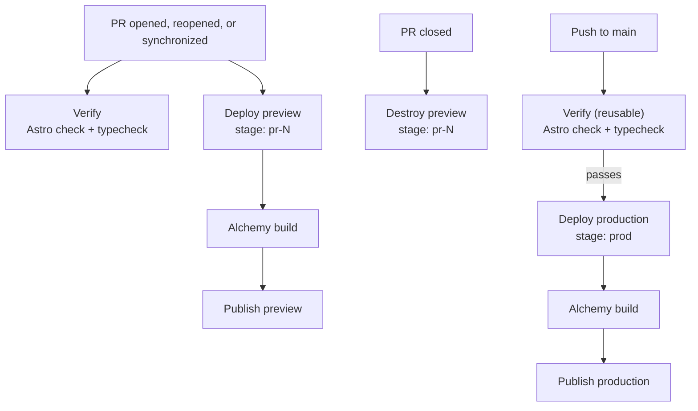

# mackie.underdown.wiki

> My personal website built with [Astro](https://astro.build/)

## CI/CD

```mermaid
flowchart TD
  PRUpdate["PR opened, reopened, or synchronized"] --> VerifyPR["Verify<br/>Astro check + typecheck"]
  PRUpdate --> DeployPreview["Deploy preview<br/>stage: pr-N"]
  DeployPreview --> PreviewBuild["Alchemy build"]
  PreviewBuild --> Preview["Publish preview"]

  PRClosed["PR closed"] --> CleanupPreview["Destroy preview<br/>stage: pr-N"]

  MainPush["Push to main"] --> VerifyProd["Verify (reusable)<br/>Astro check + typecheck"]
  VerifyProd -->|passes| DeployProd["Deploy production<br/>stage: prod"]
  DeployProd --> ProductionBuild["Alchemy build"]
  ProductionBuild --> Production["Publish production"]
```
