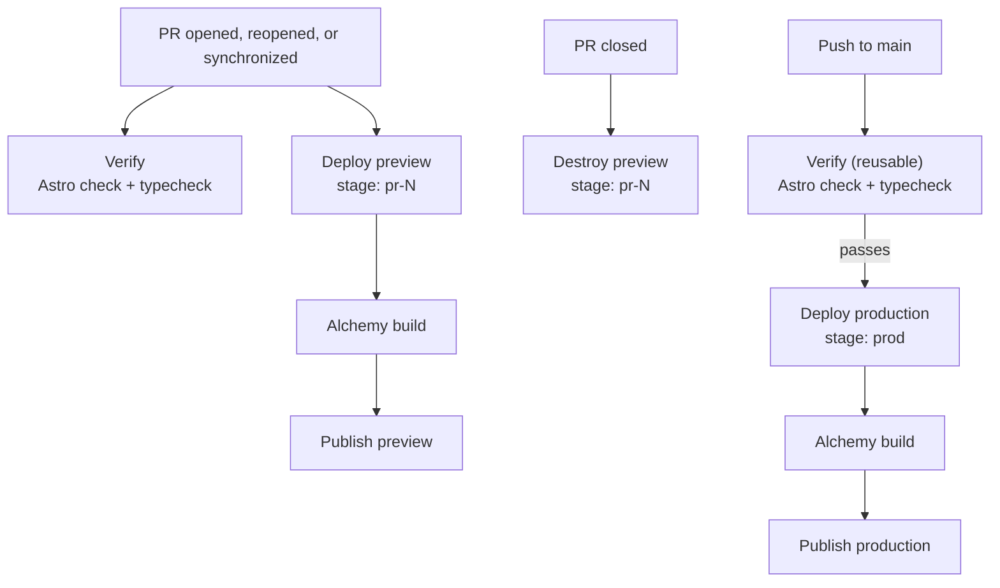

# mackie.underdown.wiki

> My personal website built with [Astro](https://astro.build/)

## UI conventions

Badge labels must use normal font weight, including inside bold links or headings.
Set the weight in `EntryKindBadge.astro`; keep entry titles and other typography unchanged.

## CI/CD

